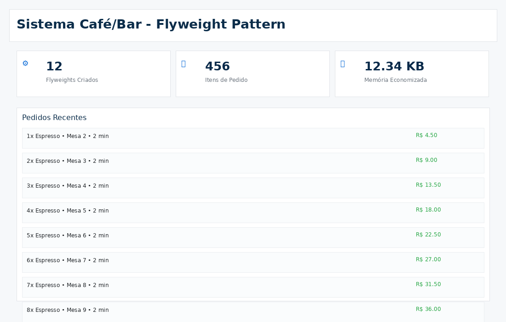

# Flyweight — Sistema de Pedidos (Cafeteria)

<p align="center">
	<a href="https://www.ufjf.br/" rel="noopener">
		
	</a>
</p>

<h3 align="center">DCC078-2025.3-A — Aspectos Avançados em Engenharia de Software (UFJF/ICE)</h3>

---

## 📝 Sumário
- [Sobre](#sobre)
- [Diagrama de Classe](#diagrama)
- [Funcionalidades](#funcionalidades)
- [Tecnologias](#tecnologias)
- [Exemplo de Uso](#exemplo)
- [Como Executar e Testes](#testes)
- [Autor](#autor)

## 🧐 Sobre <a name="sobre"></a>
> **Disciplina:** DCC078 – Aspectos Avançados em Engenharia de Software   </br>
> **Projeto:** Demonstração do padrão Flyweight em um sistema de pedidos de Cafeteria   </br>
> **Docente:** Prof. Marco Antônio Pereira Araújo  </br>
> **Data de entrega:** 18/11/2025   </br>
> **Aluno:** [Gabriel Campos Lima Alves](#autor)  </br>

### Padrão Flyweight
Implementação do padrão **Flyweight** aplicada a um sistema de pedidos de cafeteria. O foco é reduzir o número de instâncias de objetos compartilháveis (produtos) mantendo o estado externo por pedido, demonstrando:
- Uso de uma fábrica (`ProdutoFactory`) que reaproveita objetos `Produto` por nome
- Separação entre estado intrínseco (dados do `Produto`) e estado extrínseco (quantidade, tamanho, desconto em `ItemPedido`)
- Redução de memória e objetos criados quando muitos pedidos usam os mesmos produtos
- Exposição de métricas simples (total de produtos distintos carregados)

Também há uma interface de demonstração inclusa: [Interface de Demonstração (GitHub Pages)](https://camposcodes.github.io/PadroesEstruturais-Flyweight/)
<p align="center">
	
</p>

## 📐 Diagrama de Classe <a name="diagrama"></a>
O diagrama abaixo representa a arquitetura do projeto, enfatizando a fábrica de produtos e o uso do padrão **Flyweight**:

<p align="center">
	
</p>


## 🚀 Funcionalidades <a name="funcionalidades"></a>
### Sistema de Pedidos - Cafeteria
- **Produto**: Representa o estado intrínseco compartilhável (nome, categoria, preço base, tempo de preparo)
- **ProdutoFactory**: Fábrica que retorna instâncias de `Produto` reusáveis (flyweights)
- **ItemPedido**: Estado extrínseco do pedido (quantidade, tamanho, desconto) que referencia um `Produto`
- **Pedido**: Agrega `ItemPedido`s e calcula total
- **Cafeteria**: Gerencia pedidos, cria/recupera pedidos e expõe contadores (ex.: total de produtos distintos)

### Recursos
- ✅ Implementação do padrão Flyweight via `ProdutoFactory`
- ✅ Reaproveitamento de objetos `Produto` para reduzir instâncias
- ✅ Estrutura clara entre estado intrínseco e extrínseco
- ✅ Operações de criação de pedido e adição de itens
- ✅ Métrica de produtos distintos carregados (`ProdutoFactory.getTotalProdutos()`)
- ✅ Cobertura de testes com JUnit (teste de integração básica incluído)

##  Tecnologias <a name="tecnologias"></a>
- **Java 11+**
- **JUnit 5** - Framework de testes
- **Maven** - Gerenciamento de dependências
- **Git** - Controle de versão


## 📊 Exemplo de Uso <a name="exemplo"></a>
```java
// Criando produtos via fábrica (reutilizáveis - Flyweight)
Produto cafe = ProdutoFactory.getProduto("Café Expresso", "Bebida", 5.0, 3);
Produto muffin = ProdutoFactory.getProduto("Muffin Chocolate", "Salgado/Doce", 6.5, 5);

// Criando cafeteria e pedidos
Cafeteria cafeteria = new Cafeteria();
cafeteria.criarPedido(101);
cafeteria.adicionarItemAoPedido(101, cafe, 2, "Médio", 0.0);
cafeteria.adicionarItemAoPedido(101, muffin, 1, "Pequeno", 0.5);

Pedido pedido = cafeteria.obterPedido(101);
System.out.println("Itens do pedido 101:");
for (String item : pedido.obterItensPedido()) {
		System.out.println(item);
}
System.out.println("Total do pedido: R$ " + pedido.calcularTotal());

// Uso do Flyweight: quantos produtos distintos foram realmente instanciados
System.out.println("Produtos distintos carregados: " + cafeteria.getTotalProdutosDistintos());
// Mesmo chamando a fábrica novamente para "Café Expresso", não será criada nova instância
Produto cafe2 = ProdutoFactory.getProduto("Café Expresso", "Bebida", 5.0, 3);
System.out.println(cafe == cafe2); // true
```

## 🧪 Como Executar e Testes <a name="testes"></a>
### Pré-requisitos
- Java 11 ou superior
- Maven 3.6+

### Comandos
```bash
# Compilar o projeto
mvn clean compile

# Executar testes
mvn test

# Executar teste específico (exemplo)
mvn test -Dtest=padroesestruturais.flyweight.CafeteriaTest

# Empacotar
mvn package
```

### Interface de Demonstração (GitHub Pages)
- A interface de demonstração está disponível em: https://camposcodes.github.io/PadroesEstruturais-Flyweight/
- Abra o link para ver a simulação da Cafeteria e observar como o Flyweight reduz instâncias ao criar muitos pedidos.

## 👨‍💻 Autor <a name="autor"></a>
**Gabriel Campos Lima Alves**
Matrícula: 202176005
Email: campos.gabriel@estudante.ufjf.br
GitHub: [@CamposCodes](https://github.com/CamposCodes)

---

*Projeto de uso acadêmico exclusivo para a disciplina DCC078 - UFJF*

